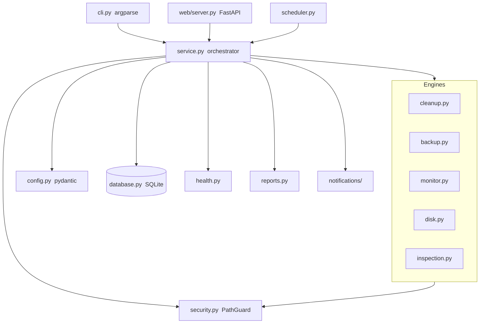

# System Maintenance Automation

A cross-platform, production-grade toolkit that automates routine system
maintenance — temporary/cache cleanup, verified backups, resource monitoring,
disk analysis, integrity checks, reporting and scheduling — behind one clean
CLI, with an optional web dashboard and notification channels.

Built for **Windows, Linux and macOS** with a safety-first design: nothing
destructive happens without passing a security guard, and deletions are moved
to a recoverable quarantine by default.

[](https://github.com/mojtaba-py-code/system-maintenance-automation/actions/workflows/ci.yml)


---

## Highlights

| Area | What it does |
|------|--------------|
| 🧹 **Cleanup** | Temp/cache files, old logs, duplicate detection (SHA-256), empty folders, recycle-bin — with **dry-run**, **quarantine** and **safe deletion** |
| 💾 **Backup** | Incremental, compressed (`zip`/`tar.gz`/`tar.bz2`), **verified** (re-hashed), **rotated** archives with a per-source manifest |
| 📊 **Monitoring** | CPU, memory, swap, per-volume disk, network and top processes with threshold **alerts** |
| 🩺 **Health score** | A transparent 0–100 score + letter grade + optimisation suggestions |
| 🔍 **Disk analysis** | Storage tree, largest sub-directories, large-file and old-file detection |
| 🔒 **Security** | Protected-path guardrails, allow-lists, path-traversal defence, least-privilege inspection |
| 🗃 **History** | SQLite store of every run, cleanup/backup stats, disk metrics and errors |
| 📝 **Reports** | JSON, CSV, HTML (self-contained) and Markdown |
| ⏰ **Scheduling** | Built-in scheduler + generated `cron` / Task Scheduler snippets |
| 🌐 **Web + API** | FastAPI dashboard and read-only REST API (optional) |
| 🔔 **Notifications** | Telegram, Discord, Slack, e-mail — gated by health score (optional) |

---

## Installation

Requires **Python 3.10+**.

```bash
git clone https://github.com/mojtaba-py-code/system-maintenance-automation.git
cd system-maintenance-automation

python -m venv .venv
# Windows:  .venv\Scripts\activate
# Linux/mac: source .venv/bin/activate

# Core install
pip install -e .

# With optional extras
pip install -e ".[web,notify,dev]"
```

This exposes the `maintenance` command (and `python -m maintenance`).

---

## Quick start

```bash
# 1. Create your local config from the example
cp config/config.example.yaml config/config.yaml   # Windows: copy config\config.example.yaml config\config.yaml

# 2. Inspect your machine
maintenance info
maintenance monitor

# 3. Preview a cleanup WITHOUT deleting anything
maintenance --dry-run clean --all

# 4. Run it for real (files go to quarantine, not oblivion)
maintenance clean --all

# 5. Back up your configured sources and verify them
maintenance backup
maintenance verify

# 6. See history and a health report
maintenance report
maintenance --output html monitor
```

> **Safety note:** destructive commands honour `require_confirmation` in your
> config and refuse to run non-interactively without `--force`. Always try
> `--dry-run` first.

---

## Command overview

```
maintenance <command> [options]

  clean       Clean temp/cache/logs, duplicates and empty folders
  backup      Create verified, rotating backups
  monitor     Report CPU/memory/disk/network and health
  disk        Analyse disk usage of one or more paths
  scan        Read-only security/system inspection
  verify      Verify integrity of existing backup archives
  hash        Print the SHA-256 of a file
  info        Show host/system information
  report      Show maintenance history and statistics
  update      Check for available package updates (read-only)
  scheduler   Run the periodic scheduler, or list native entries
  web         Launch the web dashboard + REST API

Global options:
  --config PATH   --data-dir DIR   --dry-run   --verbose   --silent
  --force         --threads N      --output {json,csv,html,markdown}   --no-report
```

See [docs/CLI.md](docs/CLI.md) for the full reference.

---

## Architecture



The design follows clean-architecture principles: a thin CLI/web/scheduler
layer calls a single **service orchestrator**, which composes independent,
single-responsibility engines. Configuration and the security guard are
injected, not global, so every component is unit-testable in isolation. See
[docs/ARCHITECTURE.md](docs/ARCHITECTURE.md).

```
system-maintenance-automation/
├── config/            # config.example.yaml (+ your git-ignored config.yaml)
├── src/maintenance/   # the package
│   ├── config.py logger.py utils.py security.py hashing.py systeminfo.py
│   ├── database.py cleanup.py backup.py monitor.py disk.py inspection.py
│   ├── health.py reports.py scheduler.py service.py cli.py
│   ├── notifications/ # telegram / discord / slack / email
│   └── web/           # FastAPI app + dashboard template
├── tests/             # 243 tests (unit + integration + security)
├── docs/              # architecture, configuration, CLI, troubleshooting, dev
├── logs/ reports/ backups/ database/   # runtime output (git-ignored)
└── pyproject.toml
```

---

## Security model

* **Protected paths** — OS-critical directories (`C:\Windows`, `/etc`, `/usr`,
  …) can never be modified. You can add your own in `security.protected_paths`.
* **Allow-lists** — restrict operations to specific roots.
* **Batch cap** — `security.max_delete_batch` bounds how many files one run may
  remove, so a pattern that suddenly matches far more than intended stops and
  reports instead of running to completion.
* **Quarantine** — deletions are *moved*, not unlinked, and stay recoverable for
  `quarantine_retention_days` before being purged for real.
* **Path-traversal defence** — archive extraction and quarantine moves are
  validated against Zip-Slip style escapes.
* **Authenticated by default when exposed** — binding the dashboard to anything
  other than loopback without an API token is *refused at startup*, not merely
  discouraged. The token protects the HTML dashboard as well as the JSON API.
* **Least privilege** — the tool *inspects* services/updates but never changes
  them; the web API is read-only apart from a dry-run preview.
* **No secrets in files** — notification/API tokens are referenced as
  `${ENV:VAR}` and resolved from the environment at load time. Webhooks are
  HTTPS-only, and an enabled integration with an empty credential is a hard
  configuration error rather than a silently dead channel.

The full model, threat boundaries and a hardening checklist are in
[SECURITY.md](SECURITY.md).

---

## Configuration

All behaviour is driven by `config/config.yaml`. Highlights:

```yaml
cleanup:
  temp_directories: ["%TEMP%", "/tmp", "~/.cache"]
  temp_extensions: [".tmp", ".bak", ".dmp"]
  quarantine: true
backup:
  sources: ["~/Documents/important"]
  archive_format: "zip"      # zip | tar.gz | tar.bz2
  incremental: true
  keep_last: 10
  verify_after_backup: true
monitor:
  cpu_threshold: 85
  memory_threshold: 90
  disk_threshold: 90
```

Full reference: [docs/CONFIGURATION.md](docs/CONFIGURATION.md).

---

## Scheduling

Run the built-in scheduler:

```bash
maintenance scheduler        # runs jobs defined under scheduler.jobs
```

…or generate native OS entries and let the platform drive it:

```bash
maintenance scheduler --list   # prints cron + schtasks equivalents
```

---

## Web dashboard (optional)

```bash
pip install -e ".[web]"
maintenance web --host 127.0.0.1 --port 8787
```

Then open <http://127.0.0.1:8787>. The REST API exposes `/api/health`,
`/api/system`, `/api/history`, `/api/disks`, `/api/disk-usage` and a dry-run
`/api/clean/preview`.

To expose it beyond localhost you **must** set a token — the server refuses to
start otherwise:

```bash
export MAINTENANCE_API_TOKEN="$(python -c 'import secrets; print(secrets.token_urlsafe(32))')"
maintenance web --host 0.0.0.0
```

Scripts authenticate with `Authorization: Bearer <token>`; browsers sign in at
`/login` and get an `HttpOnly`, `SameSite=Strict` session cookie. Repeated bad
tokens lock the client out. Put it behind a TLS-terminating proxy for anything
beyond a trusted LAN.

---

## Development

```bash
pip install -e ".[dev]"

ruff check src tests examples   # lint
mypy                      # type-check (strict)
pytest --cov              # tests + coverage
```

Quality gates on every change: **ruff** clean, **mypy** strict clean, **pytest**
green (243 tests, ~86% coverage). See [docs/DEVELOPER.md](docs/DEVELOPER.md)
and [CONTRIBUTING.md](CONTRIBUTING.md).

---

## Changelog

See [CHANGELOG.md](CHANGELOG.md).

## License

MIT — see [LICENSE](LICENSE).
